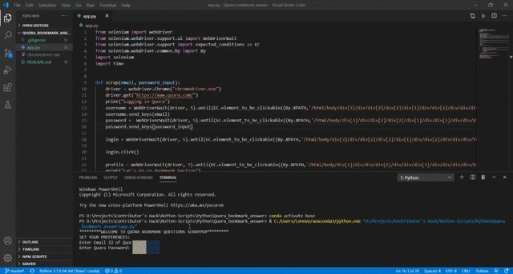

Quora Bookmarked Topics Downloader
==================================

|checkout|

This python script will download your Quora Bookmarked post into a pdf
file. Just enter your quora credentials and selenium will take care of
the rest of the part.

How to run?
-----------

.. code-block:: bash

  $ python app.py

and then follow the on screen instructions

Requirements
------------

.. code-block:: bash

  pip install selenium

.. note::
  
  Download the latest chrome driver and place it in the same directory where the script resides.

Working Demo
------------

.. |checkout| image:: https://forthebadge.com/images/badges/check-it-out.svg
  :target: https://github.com/HarshCasper/Rotten-Scripts/tree/master/Python/Quora_Bookmark_Topics_Downloader/

