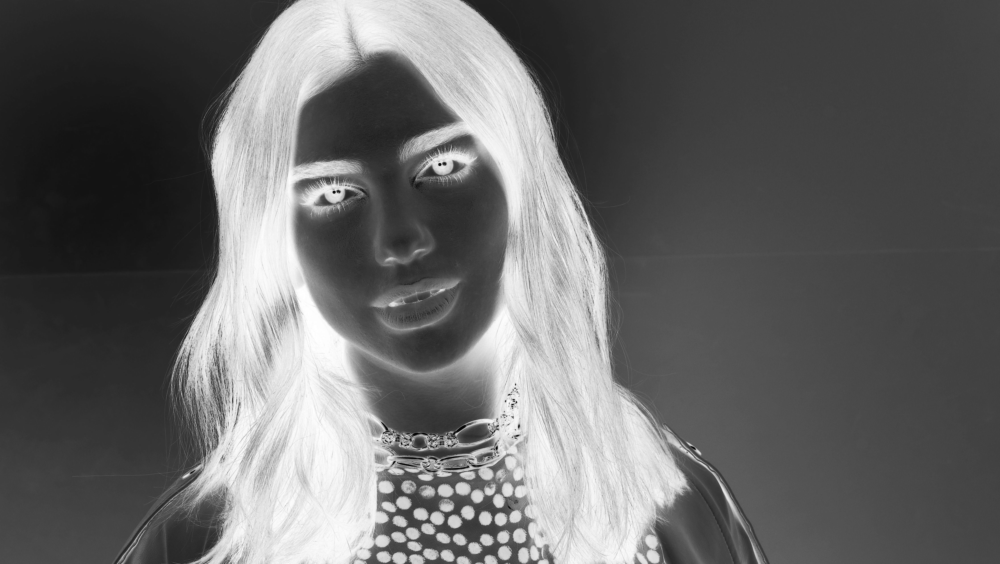

# CONVERTING IMAGE TO PENCIL SKETCH

### A RGB image can be converted into a pencil sketch using 4 easy steps!

### Step 1: Get the image and convert it into grayscale by using COLOR_BGR2GRAY from cv2.

### Step 2: Invert the image i.e, obtain the negative of the grayscale image using bitwise_not from cv2.

### Step 3: Blur the image by applying Gaussian filter to the inverted image.

### Step 4: Merge the gray scale image and the Gaussian filter applied image.

### The sketch is ready!

