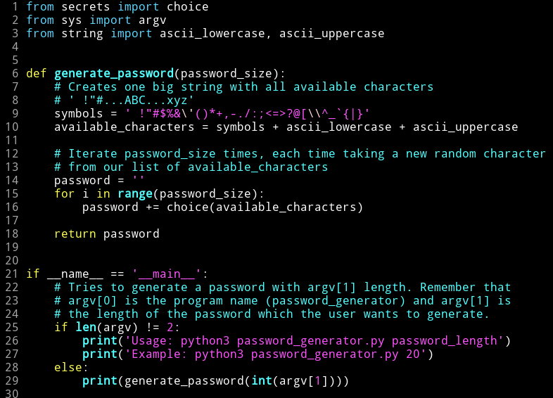
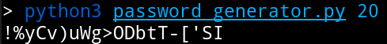

# Random password generator

A Python script to generate a random password with custom size.
It only uses the standard library, so you don't need to install anything.

### Usage example

Generate a password with size 10:
`$python3 password_generator.py 10`

Generate a password with size 30:
`$python3 password_generator.py 30`

