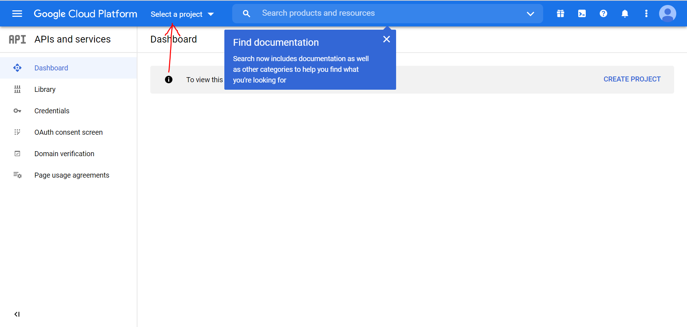
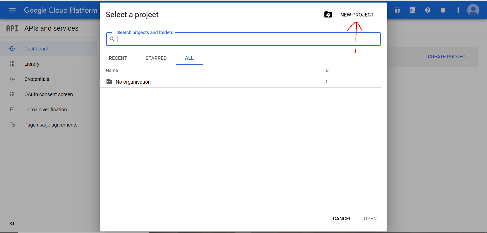
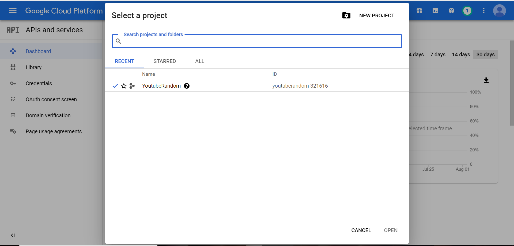
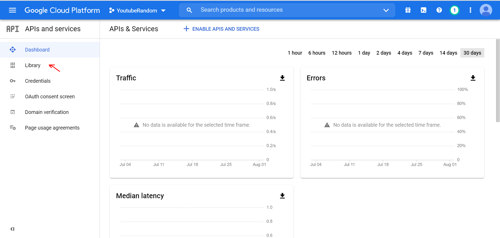
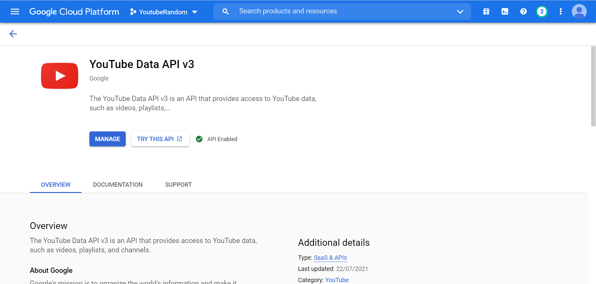
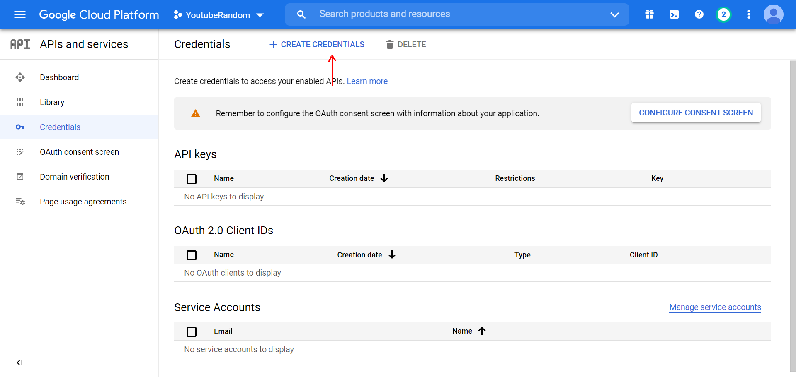
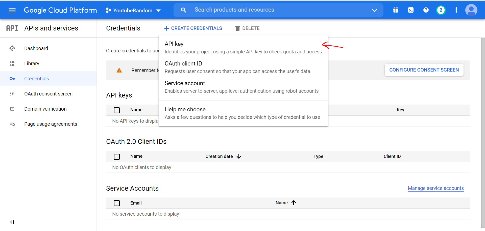

# Random Yotutbe Videos
This Python Script fetches random youtube videos on every iteration  
## Steps
#### Create a Google Account / Use an Existing Google Account and Head to : https://console.developers.google.com/ 
#### Click on Select a Project > NEW PROJECT


#### Enter a Project name and click on Create

#### Select the created project in Select a Project

#### Head to Library section

#### Search for YouTube Data API v3 and enable it

#### Click on Create Credentials

#### Click on API KEY and note your APIKEY (You will require it for searching the video)

## How to use
#### Open command prompt in the folder and run to install requirements:
```bash
pip install -r requirement.txt 
```
#### Run the Program using (Enter the generated key from [Steps](#steps)):
```bash
py randomyt.py
```
### After entering correct API a random YouTube Video will start playing
