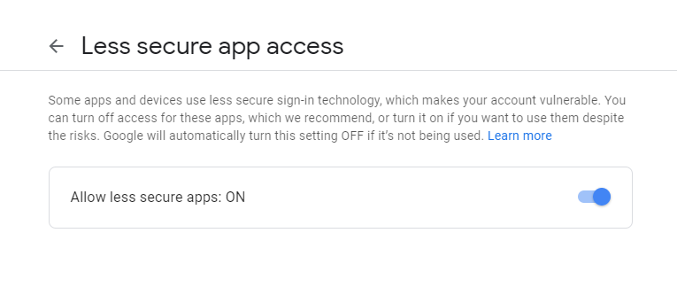

Send_Emails
===========

|checkout|

This script written in python uses the smtp module to send emails. The
details of the sender and receiver are entered into the script. The
sender must enable the less secure apps mode in order to send the email.
|less_secure| The details are in the image attached.

.. |checkout| image:: https://forthebadge.com/images/badges/check-it-out.svg
  :target: https://github.com/HarshCasper/Rotten-Scripts/tree/master/Python/Send_Emails/

