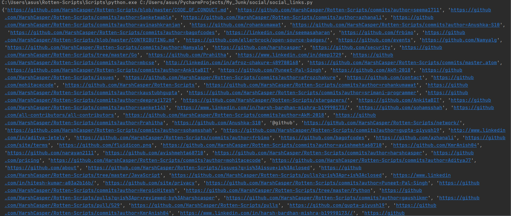

Pagespeed_API
=============

|checkout|

This small script, can be used to find all the social media links on a
webpage. The setup is a bit difficult and complex to achieve for new
comers though.

It can be used to -

-  Check all the social media links linked to a webpage.

Setup instructions and Guidelines
---------------------------------

-  This setup has only two requirement, ``pip install html_to_etree``.
-  2nd requirement need to fulfilled by remotely downloading
   `extract_social_media <https://github.com/fluquid/extract-social-media/tree/master/src extract_social_media>`__
-  You only need the ``extract_social_media`` folder as it is the only
   requirement.

After this just grab the url of webpage which yo want to find links of.

Output
------

This Snapshot clearly shows the links of all the social media on the
landing page of this repo.

|image0|

Author(s)
---------

Made by `Vybhav Chaturvedi <https://www.linkedin.com/in/vybhav-chaturvedi-0ba82614a/>`__.

.. |checkout| image:: https://forthebadge.com/images/badges/check-it-out.svg
  :target: https://github.com/HarshCasper/Rotten-Scripts/tree/master/Python/Social_Media_Links/

