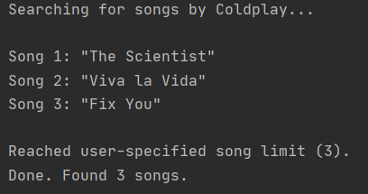

Song Popularity
===============

|checkout|

This script can be used to generate, the most popular songs by any
artist. The script uses `Genius API <https://docs.genius.com/>`__. It is
a dedicated platform meant for music only.

Setup Instruction
-----------------

-  You need an API client, (its free) follow the steps
   `here <https://docs.genius.com/>`__.
-  ``pip install lyricsgenius`` to install dedicated package.
-  Good to go, Follow guidelines mentioned as comments in code.

Output
------

Top 3 Songs by coldplay -

|image0|

Author(s)
---------

Made by `Vybhav Chaturvedi <https://www.linkedin.com/in/vybhav-chaturvedi-0ba82614a/>`__.

Disclaimers, if any
-------------------

Kindly go through this `page <https://genius.com/static/terms>`__ and
follow the guidelines and rules related to **Genius API**.

.. |checkout| image:: https://forthebadge.com/images/badges/check-it-out.svg
  :target: https://github.com/HarshCasper/Rotten-Scripts/tree/master/Python/Song_Popularity/

