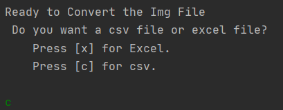
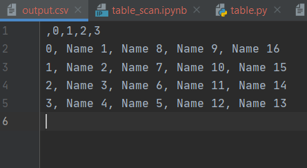
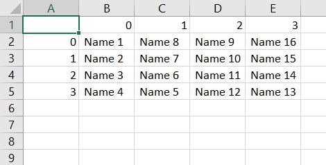

# Table to CSV/EXCEL  

  

*This README explains various things that one must know before using the script.* **KINDLY** *go through the whole file.*  
  
This **template** script converts an image of table `.png` file into `.csv` or `.xlsx`.  
  
All the steps are properly mentioned as comments in the script.  
  
### Short description of package/script  
  
- Takes `.png` or `.jpg` of a table (prefer .png) as input.  
- Scans the image.  
- Determine the structure and boundaries of the table.
- Reads the cell content.
- Converts the file in `.csv` or `.xlsx`.

## Dependency

This script has multiple dependencies, see [requiremnts.txt](requirements.txt). Most Notable ones are-

1. [Numpy](https://numpy.org/) 
2. [Pandas](https://pandas.pydata.org/)
3. [OpenCV](https://opencv.org/)
4. [Tesseract](https://github.com/tesseract-ocr/tesseract)
5. [Matplotlib](https://matplotlib.org/)
6. [Jupyter](https://jupyter.org/)
## Setup instructions  

- Set up a [Virtual Environment](https://www.geeksforgeeks.org/python-virtual-environment/#:~:text=A%20virtual%20environment%20is%20a,of%20the%20Python%20developers%20use.).

- Run the command `pip3 install -r requiremnts.txt`

- Make sure you have Tesseract.exe installed. [See this](https://github.com/tesseract-ocr/tesseract/wiki) and [this](https://stackoverflow.com/questions/50951955/pytesseract-tesseractnotfound-error-tesseract-is-not-installed-or-its-not-i)

**Important**

These are the only steps required to setup the script. But this script basically is a template which can be used as a starting point by others. (More Details in the Next Section)
  
- In the script, feed the path to the image file, and carefully change the destination path.

- Make sure you follow the guidelines.

- Carefully choose whether to convert in `.csv` (by pressing 'c') or `.xlsx` (by pressing 'x').

- Conversion Complete.
  
## Detailed explanation of template
  
The Script is basically a *template* that can be further edited according to the needs. This issue arises due to the fact that there is no set table structure. For every table structure there needs to certain changes in the code which can be easily achieve using the interactive [Jupyter Notebook](table_convert.ipynb). Follow the comments in the Notebook to make the changes. It is much more interactive than the `.py` file.

Also Encoding is a major issue in case of Excel File as different version of Excel uses different encoding techniques. Most Popular being `utf-8`  and `Windows-1252` or `CP-1252`.

Although I have used `XlsxWriter` as engine, there are various other engine which can be used according to different needs.  

## Output  
  
Test Image 

  

Grid Marked

Terminal Options

Resulted CSV

Resulted Excel

  
## Author(s)  
  
Made by [Vybhav Chaturvedi](https://www.linkedin.com/in/vybhav-chaturvedi-0ba82614a/)
  
## Disclaimers, if any  
  
It is not possible to convert every table into a `.csv` or `.xlsx` without using Sequential Deep Learning, which is not the aim of this project. I have basically provided a small template which can be used to convert every possible table, but is not universal at all.

In case you find trouble with the conversion. 
**Don't bombard [Rotten-Scripts](https://github.com/HarshCasper/Rotten-Scripts) with issues and PRs** follow this [link](https://github.com/vybhav72954/My_Junk) here you can open issues and launch PRs.