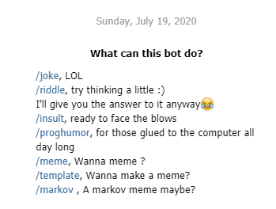
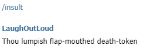
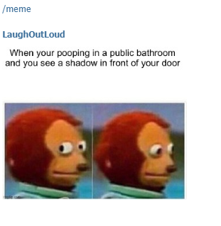
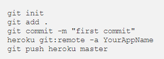

Python-Telegram Bot
===================

|checkout|

.. figure:: Lol.PNG
   :alt: Image

This is what your bot will look like!!

-  The scripts, that are a part of this repository are used to build a
   Telegram bot.
-  Python offers a very powerful and easy-to-use wrapper, to build the
   same.
-  The bot can be hosted on Heroku, a cloud platform.
-  It can be accessed by everyone who uses telegram.

The bot built here has many functionalities.

**/joke**

.. figure:: joke.PNG
   :alt: Image

**/riddle**

.. figure:: riddle.PNG
   :alt: Image

**/insult**

**/proghumor**

.. figure:: proghumor.PNG
   :alt: Image

**/meme**

**/template**

.. figure:: template.PNG
   :alt: Image

**/markov**

.. figure:: markov.PNG
   :alt: Image

The script bot.py is the most important script in this repository.

This describes the process of setting up the bot and getting it
functional
https://medium.com/@namyalg/hello-i-am-a-chatbot-9777ff53417a?source=friends_link&sk=e01c0872a9e2ebad149cc9a037fb151a

The Python-Telegram documentation is a great place to learn and
understand the basics!!

Steps to set up the bot
-----------------------

Use the token generated by telegram and replace it bot.py

In order to host it on heroku, one can follow these simple steps:

#. Create an account on Heroku
#. Hosting on Heroku requires 2 files in addition to the executable file, a Procfile and a requirements file.I have included both of them in the repository
#. pip freeze –local > requirements.txt can be used to generate the requirements
#. Here since, I am running a python script, I have used python3 in the Procfile
#. heroku login, executed from the CLI
#. git init , to initialize a git repository of all the contents
#. heroku create to create allocate an instance of a remote server
#. Use the URL generated and replace it in the bot.py file
#. git add . , to add all the contents
#. git commit
#. heroku git:remote -a name of the application generated
#. git push heroku master, to push all the contents

If the creation fails, the logs can be viewed using heroku logs –tail

.. |checkout| image:: https://forthebadge.com/images/badges/check-it-out.svg
  :target: https://github.com/HarshCasper/Rotten-Scripts/tree/master/Python/Telegram_Bot/

