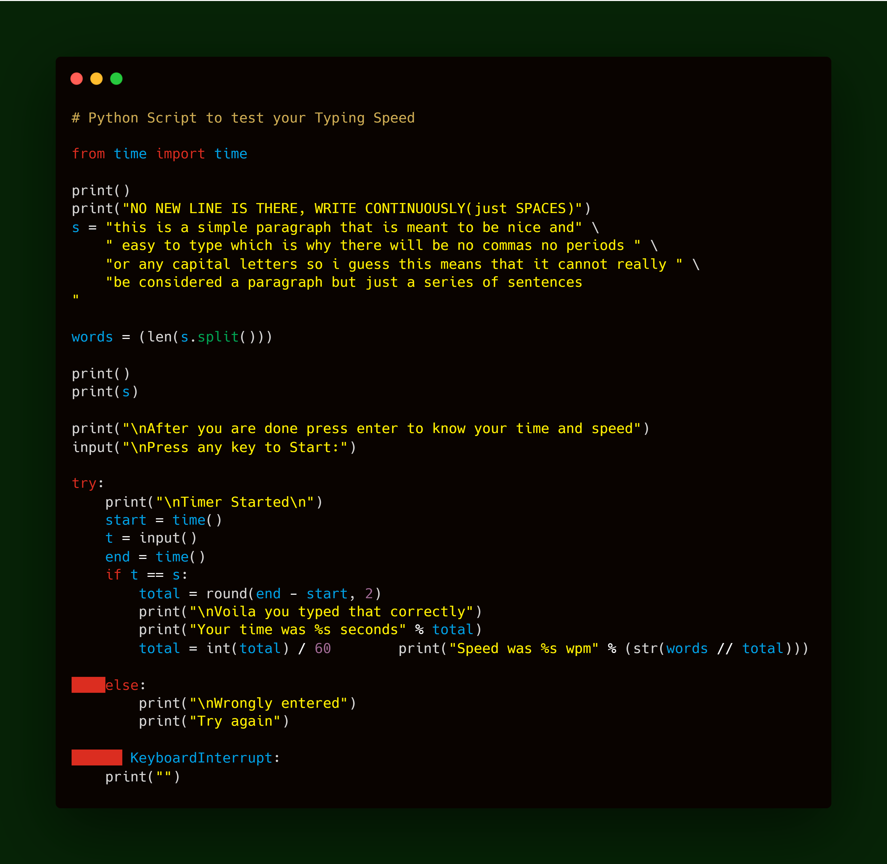

Test Typing Speed
=================

|checkout|

This is a simple Python Script which is used to test the Typing Speed of
the User using Python’s Time Module.

.. |checkout| image:: https://forthebadge.com/images/badges/check-it-out.svg
  :target: https://github.com/HarshCasper/Rotten-Scripts/tree/master/Python/Test_Typing_Speed/

