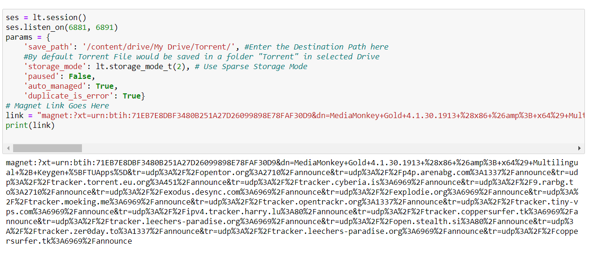
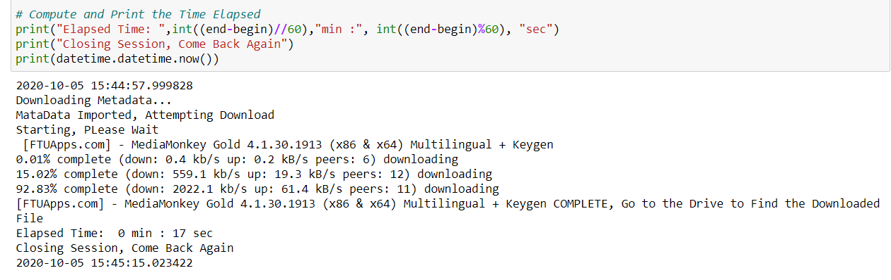
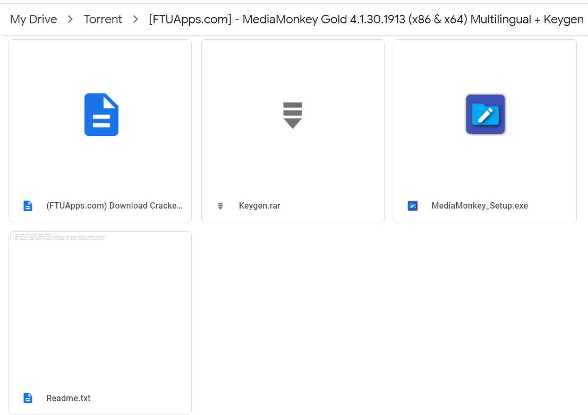

# Torrent_to_Drive

**Torrent_to_Drive** is the easiest way to do Cloud Torrenting. Using [Google Colab](https://colab.research.google.com) and [LibTorrent](https://libtorrent.org/python_binding.html) Module, the script can be used to Download any Torrent in a Google Drive using Google Cloud Server. The files can be saved anywhere on Drive.

## Setup 

 - Open the Notebook using Google Colab.
 - Run the Notebook
 - Import Drive.
 - Follow the URL, click on your Google Account.
 - Paste the Authentication Code.
 - Paste the Magnet Link of the Torrent File.
 - Change the Parameters (if required), note down the destination path.
 - Run the cells, Grab a Coffee.
 - The torrent file would be available in the Destination Path.
 - Voilà, File is available in the Drive.

## Dependencies
 - python3-libtorrent

## Future Plans

  - More Disk Space (Using the Google Colab DIsk Storage) to bypass the storage limit of Google Drive
 
## Screenshots

Magnet Link - 

Successful Download - 

Verification in Google Drive -

#### Author
Made by [Vybhav Chaturvedi](https://www.linkedin.com/in/vybhav-chaturvedi-0ba82614a/)

## Disclaimer

Using communication protocols for Peer to Peer File Sharing has been banned by various countries. Author or anyone related to Rotten-Scripts is not liable to any loss or harm caused by Torrent. One should always be aware that Torrent is not safe and should ensure proper security measures.

Abusing Google Colab Resources for demanding Cloud Computing can result in permanent ban, respect the [rules and regulations](https://research.google.com/colaboratory/faq.html#resource-limits) of Google Colab.