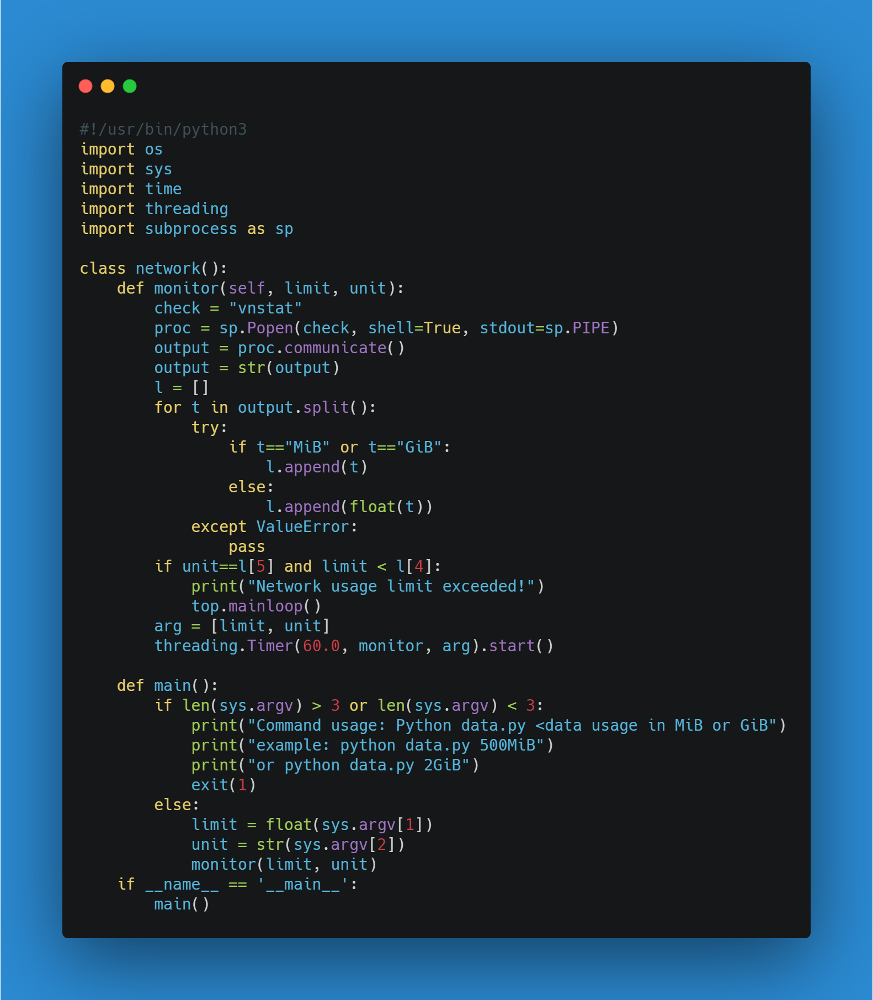

Track Data Usage
================

|checkout|

Now, the world is all about internet, and the data! We have now apps for
tracking the usage of data but they consume a lot of space in our smart
phone, so how can we tackle that? Well, there is one way, using Python.
Yes, we can use Python to automate this stuff to track our data usage.

.. figure:: https://windowsloop.com/wp-content/uploads/2019/09/Windows-10-bandwidth-usage-featured.jpg
   :alt: image

Prerequisites
-------------

1. vnstat
2. Python3
3. Linux OS
4. WiFi connection to your system.

Understanding the Code
----------------------

Firstly, you have to use a Linux system for this program, because the
``vnstat`` is available on Linux system only. I have used RHEL7 (Red Hat
Enterprise Linux).

1. To install ``vnstat``, visit`here <https://www.tecmint.com/install-vnstat-and-vnstati-to-monitor-linux-network-traffic/#:~:text=To%20install%20vnStat%20in%20RHEL,source%20tarball%20as%20shown%20below.>`__

2. Now, let’s understand the code.

.. code-block:: python

   #!/usr/bin/python3

   import os
   import sys
   import time
   import threading
   import subprocess as sp

The ``os`` module in python provides functions for interacting with the
operating system. OS, comes under Python’s standard utility modules.
This module provides a portable way of using operating system dependent
functionality.

``sys`` — System-specific parameters and functions. This module provides
access to some variables used or maintained by the interpreter and to
functions that interact strongly with the interpreter.

The Python ``time`` module provides many ways of representing time in
code, such as objects, numbers, and strings.

``threading`` module constructs higher-level threading interfaces on top
of the lower level \_thread module. To know more, visit
`here <https://docs.python.org/3/library/threading.html>`__.

The ``subprocess`` module allows you to spawn new processes, connect to
their input/output/error pipes, and obtain their return codes.

Now, I have implemented a class ``network``, so that we can access this
program from anywhere, in which there are two functions i.e. \ ``main``
and ``monitor``.

.. |checkout| image:: https://forthebadge.com/images/badges/check-it-out.svg
  :target: https://github.com/HarshCasper/Rotten-Scripts/tree/master/Python/Track_Data_Usage/

