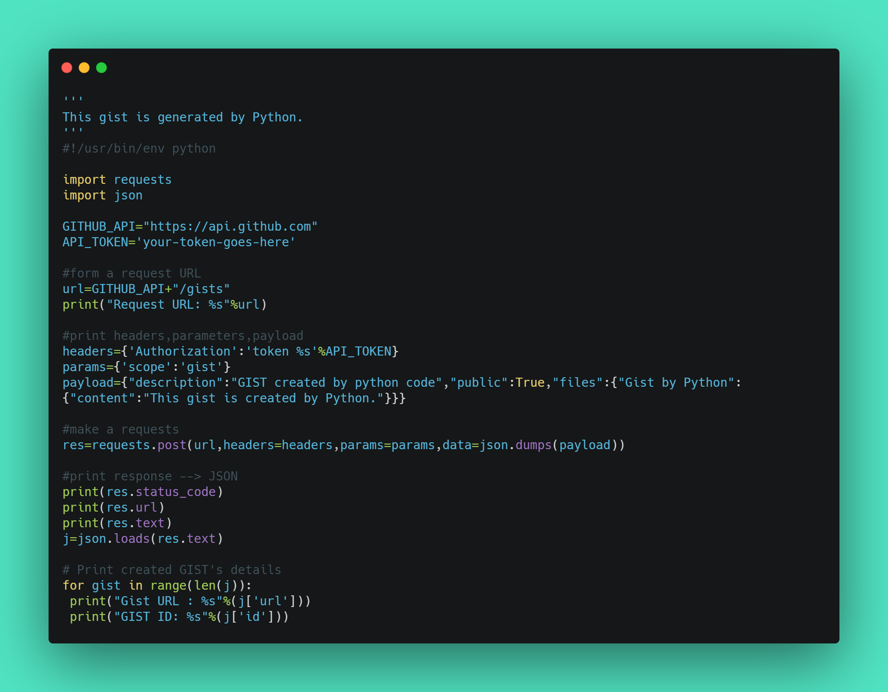
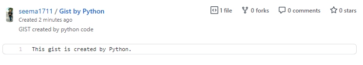

Uploading a file as a Gist using Python.
========================================

|checkout|

Have you ever made a gist?
I guess everyone who have used github or is using Github, then you
have probably made one. But ever wondered this task can be just
automated with Python?
Well, here’s how you can do that.
Let’s get started!

Prerequisites
-------------

1. json, though it is a built in function in Python, so no need to
   install it.

   **Use of ``json`` in Python:** The JSON module is mainly used to
   convert the python dictionary above into a JSON string that can be
   written into a file. While the JSON module will convert strings to
   Python datatype, normally the JSON functions are used to read and
   write directly from JSON files

2. ``pip install requests``

   **Use of ``requests`` module in Python:** The requests module allows
   you to send HTTP requests using Python. The HTTP request returns a
   Response Object with all the response data (content, encoding,
   status, etc).

3. And of course, a Github account, if you don’t have one, then make one
   from `here <https://github.com>`__.

Understanding the Code
----------------------

.. code-block:: python

   GITHUB_API="https://api.github.com"
   API_TOKEN='your-token-goes-here'

``GITHUB_API`` let’s you to connect to the api of the Github. If you
want to create a new token then go `here <https://github.com/settings/tokens>`__. Then copy your token and paste in the ``API_TOKEN`` variable.

.. code-block:: python

   # form a request URL
   url=GITHUB_API+"/gists"
   print("Request URL: %s"%url)

Now, it’s time to connect to the GITHUB gist api, for that we’ve made a
variable ``url``. Then to verify the ``url``, we’ve printed the result.

.. code-block:: python

   # print headers,parameters,payload
   headers={'Authorization':'token %s'%API_TOKEN}
   params={'scope':'gist'}
   payload={"description":"GIST created by python code","public":True,"files":{"Gist by Python":{"content":"This gist is created by Python."}}}

``headers`` variable let’s you to authorize the token provided.

``{'scope':'gist'}`` This grants you the write access to the gists.
``payload`` is created to mention the gist that we want to create.

.. code-block:: python

   res=requests.post(url,headers=headers,params=params,data=json.dumps(payload))

This will make a request to the github API.

.. code-block:: python

   # print response --> JSON
   print(res.status_code)
   print(res.url)
   print(res.text)
   j=json.loads(res.text)

As the comment describes, this will print the whole response make after
the request.

.. code-block:: python

   # Print created GIST's details
   for gist in range(len(j)):
    print("Gist URL : %s"%(j['url']))
    print("GIST ID: %s"%(j['id']))

Finally, we’ve uploaded the contents of ``payload`` to our gist.
Congratulations!!

Final result
------------

.. |checkout| image:: https://forthebadge.com/images/badges/check-it-out.svg
  :target: https://github.com/HarshCasper/Rotten-Scripts/tree/master/Python/Upload_File_As_Github_Gist/

