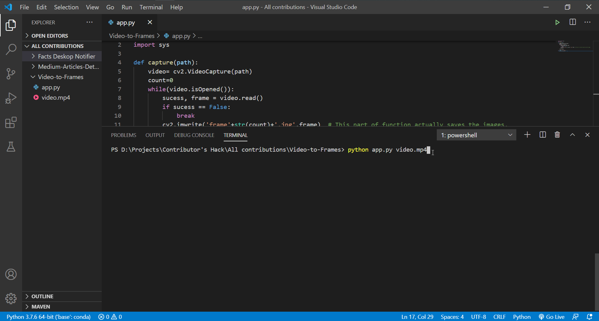

Video to Frames
===============

|checkout|

This is a basic script written in Python which converts the video file
into images frame by frame.

How to use?
-----------

Just type:

.. code-block:: bash
  
  python video_to_frames.py file-location

Example 1: When file is located in the same directory as of the script.

.. code-block:: bash

  python video_to_frames.py video.mp4

Example 2: When file is located in another location.

.. code-block::

  python video_to_frames.py D:\Projects\Contributor's Hack\Rotten-Scripts\Video-to-Frames\video.mp4

Requirements
------------

Before running the script, just install open-cv for python using this
command:

.. code-block:: bash

  pip install opencv-python

Working Demo
------------

.. |checkout| image:: https://forthebadge.com/images/badges/check-it-out.svg
  :target: https://github.com/HarshCasper/Rotten-Scripts/tree/master/Python/Video_To_Frames/

