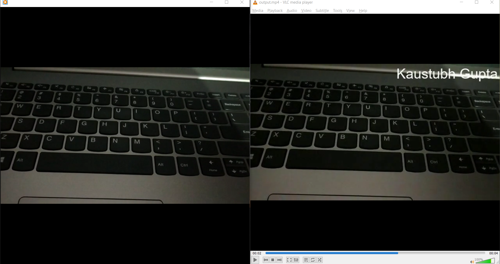

Video Watermarker
=================

|checkout|

This script watermarks the entire video given the watermark text, it’s
position and margin. First the frames of the video are converted into
images, then text is drawn and then saved in a list of images. After
this entire process, the watermarked images are combined back to video
and then audio is added to the final output. The residual files created
during the process are deleted when they are of no use.

How to use?
-----------

Just type:

.. code-block:: bash

  python app.py video-location watermark_location margin watermark_text

video_location: location of the video

watermark_location: - RT (Right Top) - RB (Right Bottom) - LB (Left
Bottom) - LT (Left Top) - C (Center)

Example:

.. code-block:: bash

  python app.py sample.mp4 RT 5 Kaustubh Gupta

Requirements
------------

Before running the script, just run the command

.. code-block:: bash

  pip install -r requirements.txt

and all dependencies will be installed

Sample
------

.. |checkout| image:: https://forthebadge.com/images/badges/check-it-out.svg
  :target: https://github.com/HarshCasper/Rotten-Scripts/tree/master/Python/Video_Watermarker/

