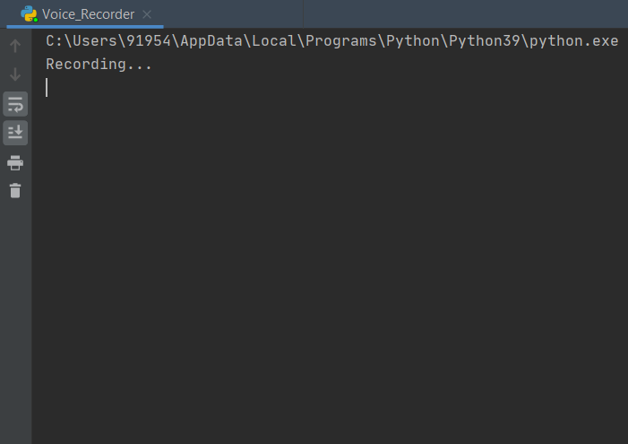
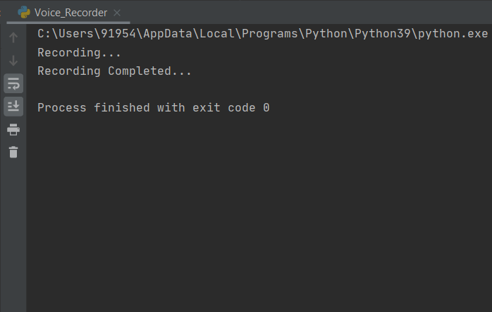

# Voice Recorder

**AIM:** 

To make a voice recorder with the help of python programming.

**PURPOSE:** 

In this project we will be using sounddevice and wavio libraries to create a voice recorder with some lines of code. 

**DESCRIPTION:**

The details of python libraries and how they are working is here-    

#### wavio

**`wavio`** - `wavio` is a Python module that defines two functions:

- `wavio.read` reads a WAV file and returns an object that holds the sampling rate, sample width (in bytes), and a numpy array containing the data.
- `wavio.write` writes a numpy array to a WAV file, optionally using a specified sample width.

#### sounddevice

**`sounddevice`** - This Python module provides bindings for the PortAudio library and a few convenience functions to play and record NumPy arrays containing audio signals.

The `sounddevice` module is available for Linux, macOS and Windows.

**INSTALLATION:**

Install the given libraries with pip command using any terminal
```python
pip install sounddevice
pip install wavio
```

**WORKING:**

Import the `sounddevice` and `wavio` module in the Python file that you are going to use for creating a voice recorder and use voice recorder in your console/application.

```python
import sounddevice as sd
import wavio as wv
# recording with the given values of duration(5 sec) and sample frequency(44000)
recording = sd.rec(int(5 * 44000), samplerate=44000, channels=2)
  
# recording audio for 5 seconds
sd.wait()
    
# converting the numpy array to audio file
wv.write("recording1.wav", recording, 44000, sampwidth=2)
```

**USAGE:**

To start using this project, follow the below guidelines: 

**1.**  Fork this project/repository. 🍴

**2.**  Clone your forked copy of the project/repository.

```
git clone https://github.com/<your-github-username>/Rotten-Scripts.git
```

**3.** Navigate to the project directory :file_folder: 

```
cd Rotten-Scripts/Voice_Recorder/
```

**4.** Install the `requirements.txt` using command 🔧

```
pip install -r requirements.txt
```

**5.** Run `voice_recorder.py` file in PyCharm IDE or Jupyter Notebook or any other platform 💻

**SCREENSHOTS:**
<div align="center">




</div>

### Contributor

<a href="https://github.com/Umesh-01">Umesh Singh</a>
