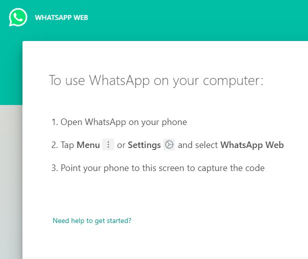
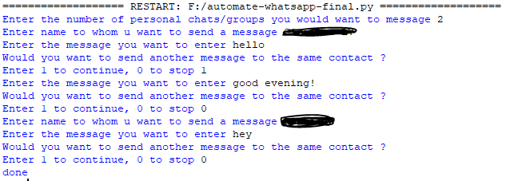

# Automate-sending-WhatsApp-messages

- This script can be used to send messages to your contacts on WhatsApp from your Command line!!

## Working ##
- The URL, https://web.whatsapp.com/ needs to be opened and initiate.

- On the right side there is a QR code which needs to be scanned in order to open WhatsApp over the web.

- The icon circled in the image is can be used to look for contacts/groups
- The script is automated to click on the search button (circled button)

- On clicking the button, it opens into the above image.
- Further, the name can be typed into the search bar. The ENTER key will be pressed by the script.
- The chat of the entered contact will be opened.

- The script looks as shown below
- Messages can be sent to more than one contact, 
- More than one message can be sent to the same contact

