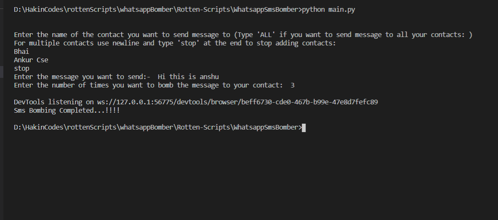

Whatsapp SMS Bomber App
=======================

|checkout|

::

   As the name suggest this app is used to automate your task in sending multiple message to either single user or multiple users in
   your contact list. Based solely on the concept this app can also be used to send invitation message or notice message to all the
   users in your contacts.

Demo of my app
--------------

Requirements
------------

::

   - Python 3.6 or above
   - Google Chrome
   - Selenium library
   - Chrome Driver downloaded from the url given below in the links section based upon the version of Chrome
     you are using.

How to Use
----------

::

   - Install Python 3.6 or above from the url given in the links section.
   - Run "pip install selenium" in your cmd terminal to install Selenium.
   - Download the chrome webdriver from the Url given in Links section and place that in  "C:\WebDriver\bin".
   - Create the WebDriver and bin folder and place your downloaded file and add that to your path in enviroment variable.
   - Clone the repo in your local machine.
   - Edit the "mycontacts.py" and add your contacts in the given format
   - Run the program.Enjoy

Links
-----

`To download ChromeDriver <https://chromedriver.chromium.org/downloads>`__ `Official Website to download Python <https://www.python.org/downloads/>`__

.. |checkout| image:: https://forthebadge.com/images/badges/check-it-out.svg
  :target: https://github.com/HarshCasper/Rotten-Scripts/tree/master/Python/Whatsapp_Sms_Bomber/

