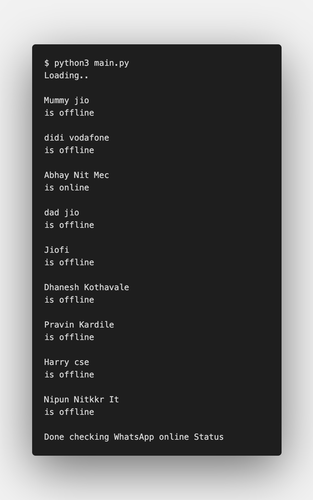

Python Script to check who is Online on WhatsApp using Selenium
===============================================================

|checkout|

Steps to use script:
--------------------

::

   1. Clone the Repo
   2. In the users.py file update the username of the contacts
   3. Run $ python3 who_is_online_on_whatsapp.py

OUTPUT:
-------

.. |checkout| image:: https://forthebadge.com/images/badges/check-it-out.svg
  :target: https://github.com/HarshCasper/Rotten-Scripts/tree/master/Python/Who_Is_Online_On_WhatsApp/

