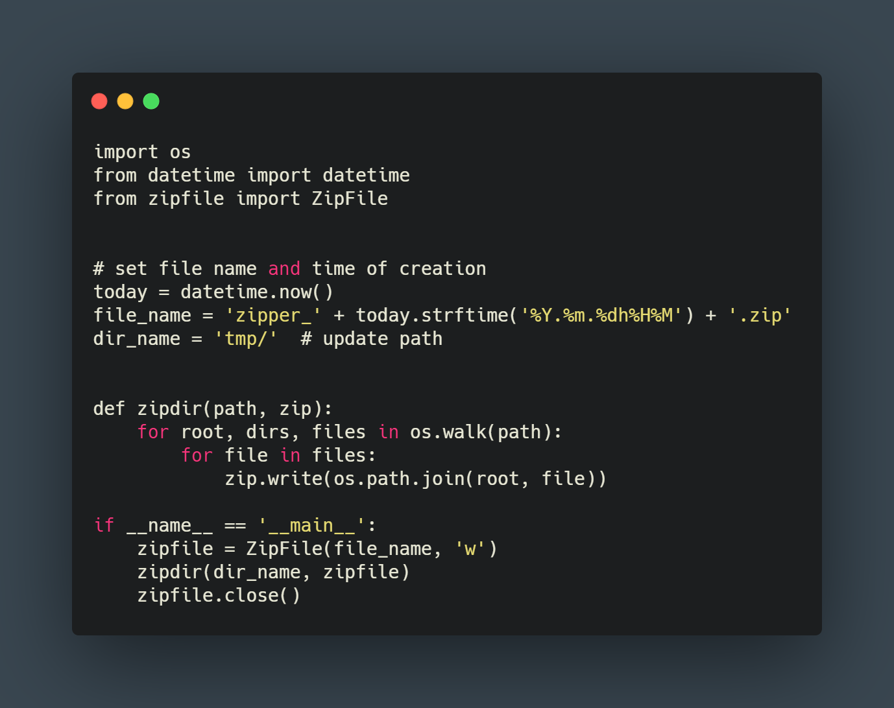

Zipper
======

|checkout|

This Script is used as Zip file creator and can convert your desired
folder to Zip File.

Update the path to your desired directory which you want to convert
to Zip File.

.. |checkout| image:: https://forthebadge.com/images/badges/check-it-out.svg
  :target: https://github.com/HarshCasper/Rotten-Scripts/tree/master/Python/Zipper/

