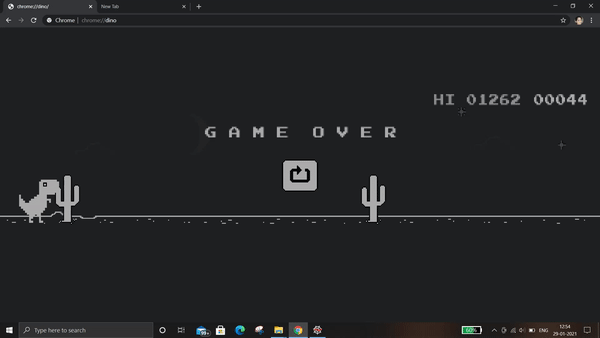

## Chrome Dino Game Automation Using Pyhton

For doing automation I had used python libraries such as pyautogui and pillow .

To play dino game we need to take care of two obstacles : first the cactus coming in between and second the bird flying above.

To know the location of the obstacles first we need to find the X and Y locations of them on screen . Check coordinates.py file

# To identify enemies
Then to make dino identify the cactus and bird , captured the image of two make a frame of it and trained dino to escape it.
Luckily , we have only three colors in this game : black(for night) , white(for day)  and gray.(for obstacles and dino)
So , we have to match the gray pixels and if obstacle  is close to dino then  make a jump. For this take a image with obstacles coming in between using ImageGrab from pillow library and then find out the pixels in which the obstacles are coming. Check enemy_location_checker.py file

# To run bot
First increase the search width for evey second the bot goes (Use time module from python) to simulate the dino acceleration.
Second get the background color (night and day) .
Third reverse loop for dino to get searched from back of screenshot to identify obstacle and it will speed up the program.

Check main.py file

After running the main.py file go to chrome browser where dino game is opened(chrome://dino) and then start game by pressing space bar and it will play automatically.

I had attached a gif to show how it plays.

