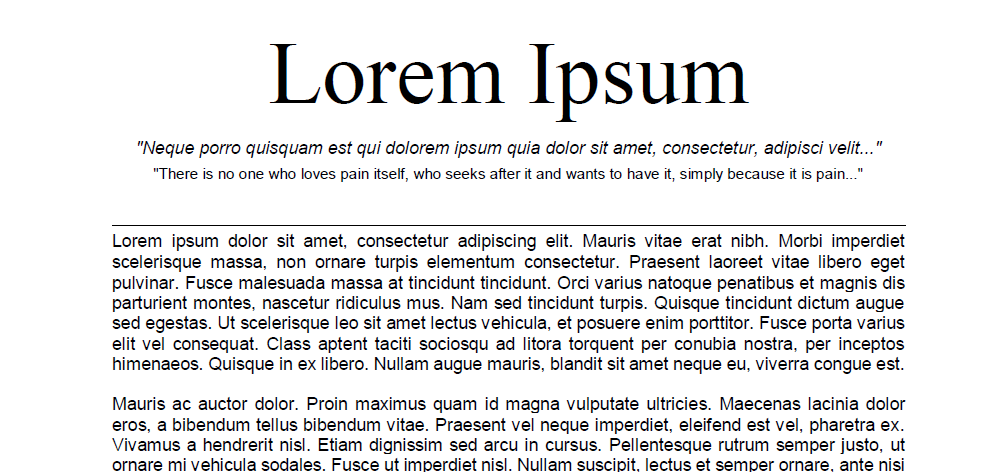
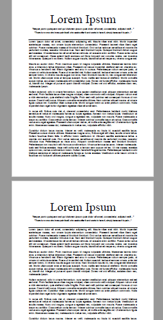

# How it is Helpful?
- It is very short and readable code.
- If you have lots and lots of pdf (even more than 100) you can merge them in a go!
- It does not show every page and pdf before merging ,so it saves lots of time.

# Ouick Start
- Clone this repository.
`git clone https://github.com/HarshCasper/Rotten-Scripts.git`
- Change directories:
` cd Rotten-Scripts`,
  then,

  `cd Python`,
  then,

  `cd pdf_merger`
- Run pdf_merger.py
`python pdf_merger.py`

## Screenshots:

# Output

