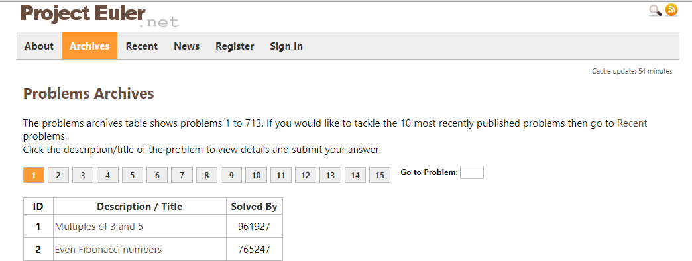

# Project Euler #

Project Euler is a series of challenging mathematical/computer programming problems that will require more than just mathematical insights to solve.

This script written in Python, gets all the 700+ questions across 15 pages which is written into a CSV file.

Beautiful Soup is used for scraping the URL : https://projecteuler.net/archives

Regular expressions have also been used in order to obtain the description of the questions

## Implementation ##

Using **inspect element**, the contents of the page can be understood

The structure of each page is as shown

The <tr> element consists of the description of the question

Each question has the following components

The contents are parsed and stored using Beautiful Soup, a library built for web scraping
