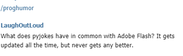
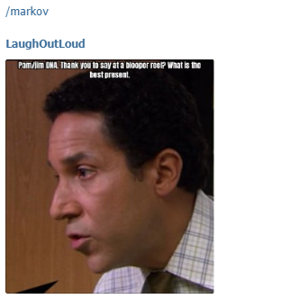

# Python-Telegram Bot #

This is what your bot will look like!!

- The scripts, that are a part of this repository are used to build a Telegram bot.
- Python offers a very powerful and easy-to-use wrapper, to build the same.
- The bot can be hosted on Heroku, a cloud platform.
- It can be accessed by everyone who uses telegram.

The bot built here has many functionalities.

**/joke**

**/riddle**

**/insult**

**/proghumor**

**/meme**

**/template**

**/markov**

The script bot.py is the most important script in this repository.

This describes the process of setting up the bot and getting it functional
https://medium.com/@namyalg/hello-i-am-a-chatbot-9777ff53417a?source=friends_link&sk=e01c0872a9e2ebad149cc9a037fb151a

The Python-Telegram documentation is a great place to learn and understand the basics!!

## Steps to set up the bot ##

Use the token generated by telegram and replace it bot.py

In order to host it on heroku, one can follow these simple steps:

1.Create an account on Heroku

2.Hosting on Heroku requires 2 files in addition to the executable file, a Procfile and a requirements file.I have included both of them in the repository

3.pip freeze --local > requirements.txt can be used to generate the requirements

4.Here since, I am running a python script, I have used python3 in the Procfile

5.heroku login, executed from the CLI

6.git init , to initialize a git repository of all the contents

7.heroku create to create allocate an instance of a remote server

8.Use the URL generated and replace it in the bot.py file

9.git add . , to add all the contents

10.git commit 

12.heroku git:remote -a name of the application generated

11.git push heroku master, to push all the contents

If the creation fails, the logs can be viewed using heroku logs --tail

