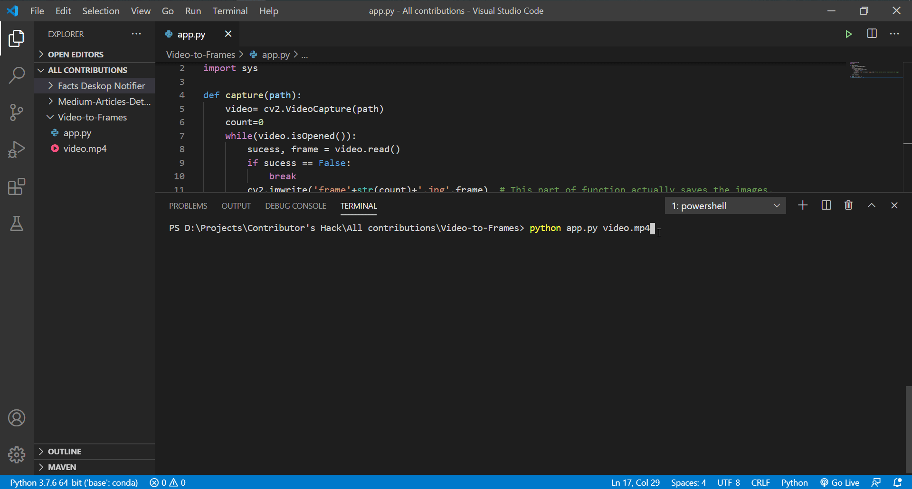

# Video to Frames
This is a basic script written in Python which converts the video file into images frame by frame.

# How to use?
Just type:

```python app.py file-location```

Example 1: When file is located in the same directory as of the scrpit.

```python app.py video.mp4```

Example 2: When file is located in another location.

```python app.py D:\Projects\Contributor's Hack\Rotten-Scripts\Video-to-Frames\video.mp4```

# Requirements
Before running the script, just install open-cv for python using this command:

```pip install opencv-python```

# Working Demo



