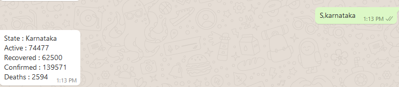
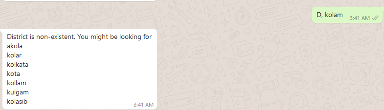

# Whatsapp Bot that returns COVID statistics #
- This script written in Python, can be used to build a whatsapp bot. Here the use case is specific to returning statistics about COVID 
of all the countries in the world, all the Indian states and districts.

- Twilio allows software developers to programmatically make and receive phone calls, send and receive text messages, and perform other communication functions using its web service APIs. Here I have made use of the same service.

- Open source API's that provide realtime information about COVID have also been used here.
- For statistics about COVID cases in the world : https://api.covid19api.com/
- For statistics about COVID cases in India (all states and districts) : https://api.covid19india.org/data.json

## How to Use ##

Following the instructions as given below, an account can be setup on Twilio.

- https://www.twilio.com/docs/whatsapp/sandbox

In order to interact with the bot, the user must drop the text mentioned to the phone number and enter the code mentioned, To interact with the bot made, the code **join fight-yet**, after which such a message will appear.

In order to obtain statistics about COVID-19, the user must enter :
- COUNTRY/country/c/C/Country or STATE/State/S/s/state or DISTRICT/district/D/d/District 
- Followed by a comma
- Followed by the name of the Country, State or District (These are limited to Indian States and Districts)
- The query entered by the user is case-insensitive

As an example : 

- The bot alerts the user in case the entered location is non-existent.
- In case of a spelling error, the bot suggests the possible locations that exist.

## Hosting and deployment ##
- The bot has been hosted on heroku, thus might take a while for the server to turn on if it has remained inactive.
- app.py, is the main script, there is a Procfile and requirements.txt file as needed by heroku.
- The other scripts are helper scripts and are used to call the different API's

